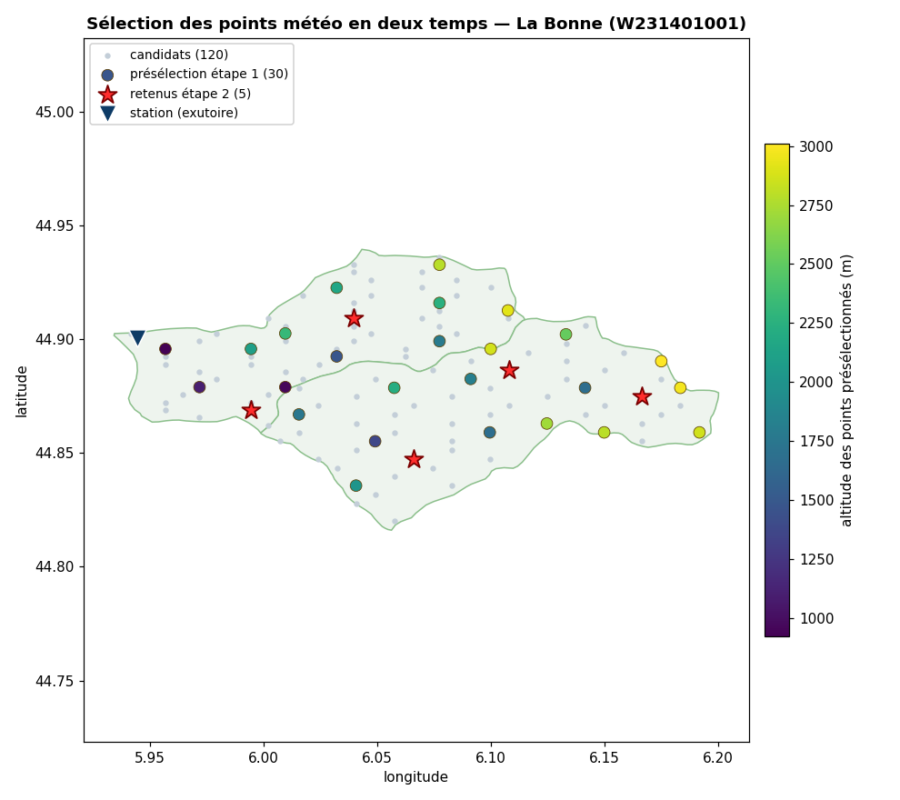
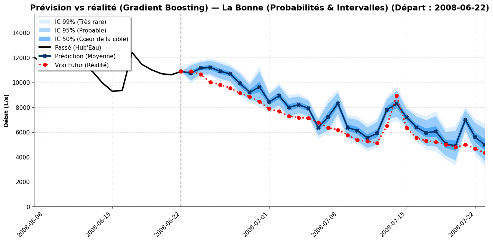

# river_level

Ce projet a pour objectif de prédire le niveau d'eau des rivières. Un projet qui lie mes études en mathématiques/science de la donnée et ma pratique de kayakiste de rivière à très bon niveau.

Nous allons, au moins pour l'instant, nous intéresser aux rivières à débit naturel, c'est à dire celles qui ne sont pas régulées par des barrages ou autres aménagements.

Et dans un premier temps, nous prendrons comme premier cas d'étude la rivière "La Bonne" dans le département de l'Isère (38).

Nous allons tenter de construire des modèles mathématiques prenant en compte des données météorologiques (pluie, température, etc.), des données hydrologiques (débit) ainsi que la date pour prédire le niveau d'eau de la rivière sur les prochains jours (typiquement 15 jours qui la durée de la prévision météo).

# Les données

## Les données hydrologiques

https://hydro.eaufrance.fr met a disposition les niveaux d'eau d'un très grand nombre de rivière.

## Données météorologiques

https://archive-api.open-meteo.com/v1/archive et https://api.open-meteo.com/v1/forecast mettent à disposition des données météorologiques historiques et prévisionnelles.

## La date

Nous allons encoder la date de manière cyclique pour que le modèle puisse comprendre la saisonnalité des données (ex: éviter la discontinuité entre le 31/12 et le 1/01).

# Les premiers modèles

Tout d'abord les données d'eau heures par heures ne sont gardées que pour les 30 derniers jours, Ce qui est insuffisant pour entraîner un modèle de machine learning. Nous allons donc nous intéresser aux données journalières, qui elles sont conservées depuis plusieurs dizaines d'années (dépandant des rivières).

Nos premiers modèles prennent donc en entrée les données météorologiques et hydroliques des 20 derniers jours pour prédire le niveau d'eau de la rivière sur les 15 prochains jours.

ce qui donne un problème de régression multivariée avec 67 variables d'entrée et 16 variables de sortie (jour J et les 15 jours suivants).
Le résultat des différents modeles est évalué avec le coefficient de détermination R² donné jour par jour.

## Premiers résultats

un exemple de prédiction sur 15 jours avec le modèle de réseau de neurones est donné ci-dessous :

Les performances des différents modèles sont données ci-dessous :

C'est premiers résultats sont déjà satisfaisants (Les modèles polynomiaux était assez mauvais donc je ne les ai pas mis sur le graphique).
J'ai toutefois l'impression d'avoir heurté un plafond de performance. Je vais donc maintenant essayer d'augmenter et d'améliorer les variables d'entrées.

PS : J'ai pour l'instant choisi les hyperparamètres des modèles sur les données test pour aller plus vite mais pour les modèles finaux je ferai un vrai split train/test/validation voir de la cross-validation.

# Améliorer les entrées : utiliser plusieurs points météo

Jusqu'ici je prenais la météo en **un seul point**. Mais le débit d'une rivière ne dépend pas d'un point : il dépend de la pluie et de la neige tombées sur **tout le bassin versant en amont**. Il faut donc plusieurs points météo, répartis sur le bassin.

Le problème : on ne peut pas tout prendre. Chaque point ajoute des dizaines de variables (donc de la dimension et du sur-apprentissage) et surtout **coûte des requêtes à l'API** Open-Meteo (qui facture par point × par jour). La question devient donc : **quels points choisir ?**

## Une première idée : l'algorithme génétique

Ma première approche a été un **algorithme génétique** (DEAP) : on part de configurations de points au hasard, on les fait « évoluer » (croisements, mutations), et on juge chaque configuration en entraînant un petit modèle Ridge et en regardant son R². Ça marche, mais c'est **lourd** : il faut télécharger la météo de beaucoup de points sur plusieurs années, puis entraîner des milliers de modèles — long, et on se heurte vite aux limites de l'API.

## La méthode retenue : une sélection en deux temps

L'idée qui marche vraiment est d'utiliser **d'abord les informations gratuites**, puis de ne payer l'API que sur les survivants.

**Étape 1 — gratuite (altitude + couverture + zones).** Sur une grille dense de points candidats, je récupère leur **altitude** (endpoint dédié, sans coût météo) et je sélectionne ~30 points par un algorithme **glouton** qui maximise une fonction combinant : la couverture spatiale du bassin, l'altitude (c'est en haut qu'il y a la neige et la pluie orographique) et l'équilibre entre les différentes zones hydrographiques. Cette fonction est *sous-modulaire*, ce qui garantit que le glouton atteint au moins 63 % de l'optimum — mieux et bien plus vite qu'un algorithme génétique.

**Étape 2 — API légère (corrélation pluie→débit + neige).** Seulement sur ces ~30 points, je télécharge un peu de météo (2 ans) et je garde les ~5 meilleurs selon leur **corrélation décalée pluie→débit** (au passage, le décalage optimal donne le *temps de réponse du bassin*) et leur **stock de neige**, tout en gardant des points bien répartis.

*Sur La Bonne : les 120 candidats (gris), les 30 présélectionnés sur l'altitude et la couverture (colorés par altitude), et les 5 points finaux retenus (étoiles rouges), de la source jusqu'à la station.*

Le détail mathématique (formules, garantie du glouton) est dans [`docs/selection_points.md`](docs/selection_points.md).

# Le résultat

Le modèle final (Gradient Boosting) prédit le débit des 15 prochains jours, avec en plus une **estimation de l'incertitude** : un petit réseau apprend la variance des erreurs, ce qui donne des **intervalles de confiance** (50 / 95 / 99 %) autour de la prévision.

*Un exemple sur le passé (backtest) : la prévision (bleu) suit la réalité (rouge) sur 15 jours, et les bandes bleues donnent la marge d'incertitude.*

Tout ceci est utilisable via une **interface web** : on choisit une rivière sur une carte, un bouton « Analyser » lance toute la chaîne (sélection des points → téléchargement → entraînement), et on visualise ensuite les prévisions et leur fiabilité. Les réglages techniques (paramètres, entraînement des modèles, quotas API) sont regroupés dans un panneau séparé pour rester utilisable par tout le monde.

